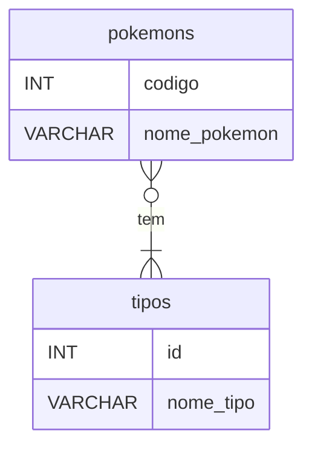

# Pokedex

Este projeto é uma Pokédex para o professor Carvalho!

Nele foram utilizadas as seguintes tecnologias:

- Django (Python 3.12.7)
- Vite + React

Onde para o backend, temos o seguinte schema para nossa database em SQLite




## Setup

O primeiro passo é clonar o repositório no diretório desejado
```terminal
git clone https://github.com/Costa-LG/Pokedex.git
```

Precisamos utilizar dois terminais, um para hostear o backend enquanto outro será dedicado ao frontend.

### Backend
Primeiro mudamos o diretorio para a pasta backend
```terminal
cd backend
```

Para então criarmos nosso Python virtual enviroment
```terminal
python -m venv venv             # criando
venv\Scripts\activate           # ativando no windows
pip install -r requirements.txt # instalando os requerimentos no ambiente virtual
```

Podemos finalmente hostear o servidor local com
```terminal
python manage.py runserver
```

### Frontend
Similarmente ao back, o primeiro passo é mudarmos o diretório
```terminal
cd frontend
```
Com o Node previamente instalado, utilizamos
```
npm install # instalando node package manager
```
Por fim rodamos o servidor local
```
npm run dev
```

## Video de Apresentação do Projeto

